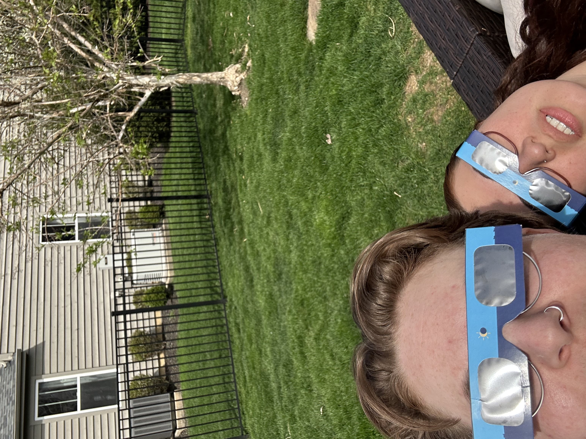
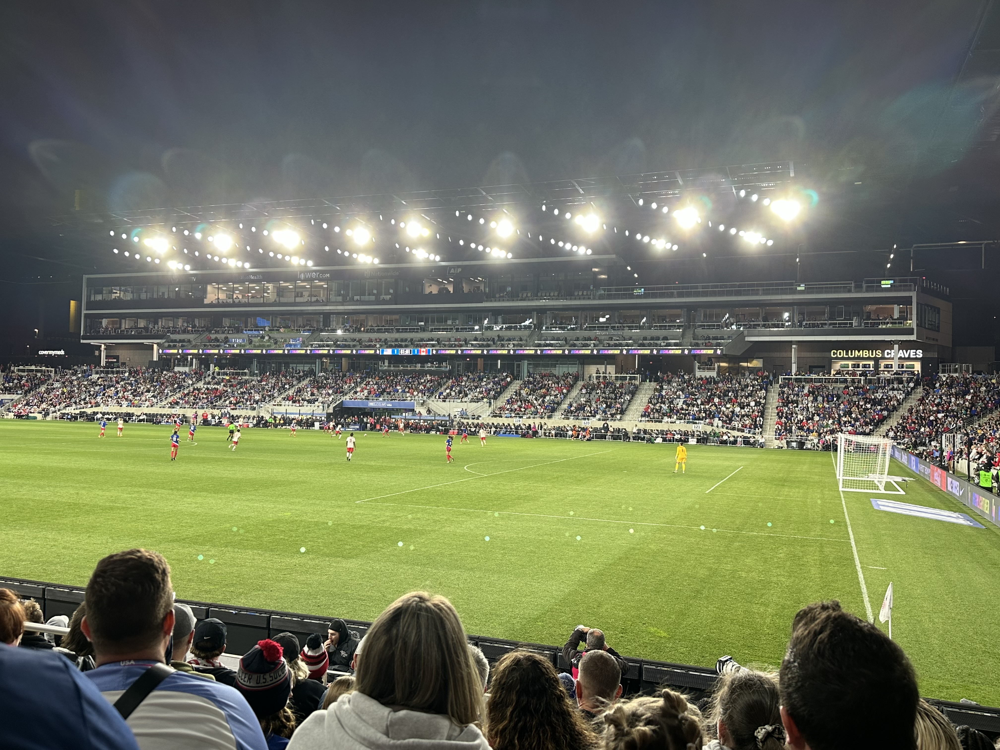

And with that, April is all wrapped up. A busy month for sure, but with our upcoming move, it's bound
to be even more busy up until that point.

# Notable

**A (99% Total) Eclipse of the Heart**. Andrea and I went to my family's house in Ohio to view the eclipse.
We got a sick view, and even sicker glasses. Space is cool as shit.

**A Full Day of Footy**. The USWNT held the final games of their annual SheBelieves cup in Columbus this year,
and coincidentally was the day after the solar eclipse. We started off by watching Marta and Brazil take on
Japan. The game ended with penalty kicks. Then, we watched the United States play Canada (which also ended in
kicks).

To wrap up the day, we went home and watched my beloved Columbus Crew knock Tigres out of the Concacaf Champions
Cup in penalties. So many penalties.

**Air and Space Museum**. Andrea and I visited the Smithsonian Air and Space museum like the true nerds that we
are. It's been under renovation pretty much the entire time that we've lived in D.C. Much to our dismay, it was
_still under renovation_.

**The Habit Experiment**. I wrote about my struggle to stay physically active pretty in depth
[here](https://spooklore.com/notebook/the-habit-experiment). Since then, I've recorded 18 workouts on Strava. So,
whatever I am figuring out seems to working.

# Work

I spent most of this month working on the front and backend implementations of a CFR 21 Compliant feature that allows
researchers to countersign digitally signed consents.

# Numbers

|Habit|Count|
|:--:|:---:|
|Active Days|20|
|Miles|15.3|
|Workout Hours|16|
|Walks|12|
|Weight Lifting|10|
|Dancing|4|
|Reading Days|16|

# Content

Read

- Queen of Shadows by Sarah J. Maas
- Dune by Frank Herbert

Watched
- Derry Girls (Netflix)
