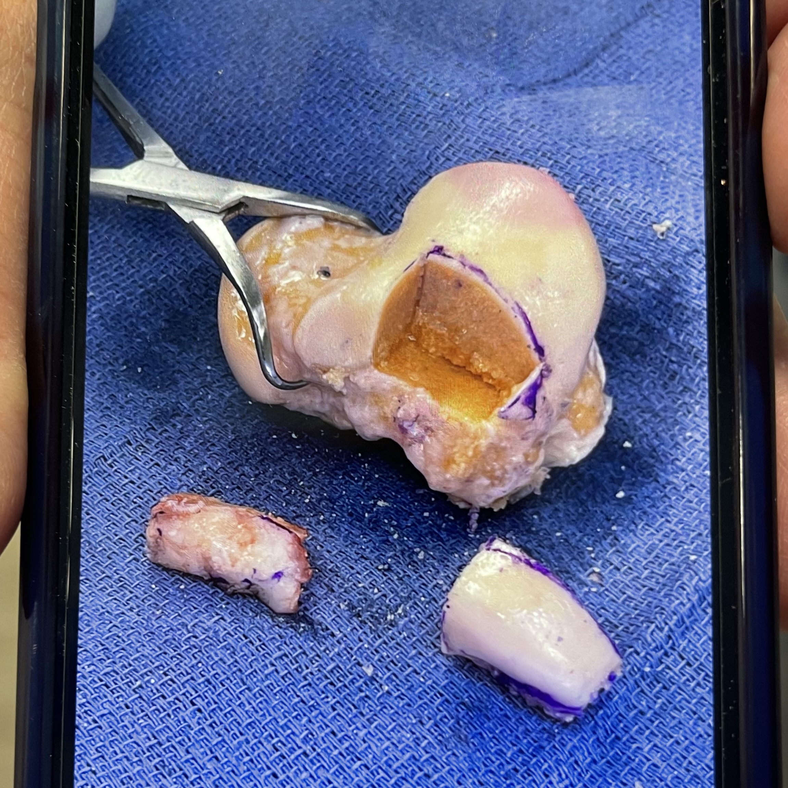

I'm beginning a part of my life where I am about to be very busy for the next upcoming months. My long time partner has been accepted to a Ph.D. program, and I am beyond excited for her.

However, that meant we spent the end of February and beginning of March traveling around the midwest visiting schools. Thus, I've been unable to get out this update. So anyways, here it is. Better late than never!

# Video Games

I started and finished the following video games:

- The Last of Us II
- Uncharted 4

I think TLOFII might be my favorite video game of all time. Without giving any spoilers, the plot is just so captivating and it continues to build on the themes of justice (no matter the cost) and people being just as terrifying and horrible as the actual monsters.

# Reading

This month I was _super_ slow with my reading. I finished Heir of Fire by Sarah J. Maas, part of the throne of glass series and To Shape a Dragon's Breath.

It was honestly not my favorite of the ones I've read so far, but I will likely continue with the series. After finishing, I began The Adventures of Amina Al-Sirafi, which I am still working through.

# Physical Therapy

I had a fourth ankle surgey in December 2023 for my chronic ankle issues. In April 2022 I had what was essentially a transplant procedure of my talus bone. For all you nerds, it was called a Bulk Allograft Transplant of the Talus.

Basically, they cut a huge chunk out of a cadaver donor bone, and grafted it into my own ankle. For those curious what this looks like, check out the photo below

**WARNING**: Not for the squeemish!

My bone is on the left and being compared to the cadaver on the right. The donor bone is above both grafts.

My revision surgey in December was to remove any hardware and some spurring that happened. Since then, I have started PT and am working on regaining any lost strength.

# Canine Good Citizen

My dog Moose is arguably too smart for his own good, so I decided to put that to good use. We started our next round of courses, working towards the AKC Canine Good Citizen Certification. Our goal is to get him certified before we move in late July.

---

And there you have it! That is my overview for the month of February.
