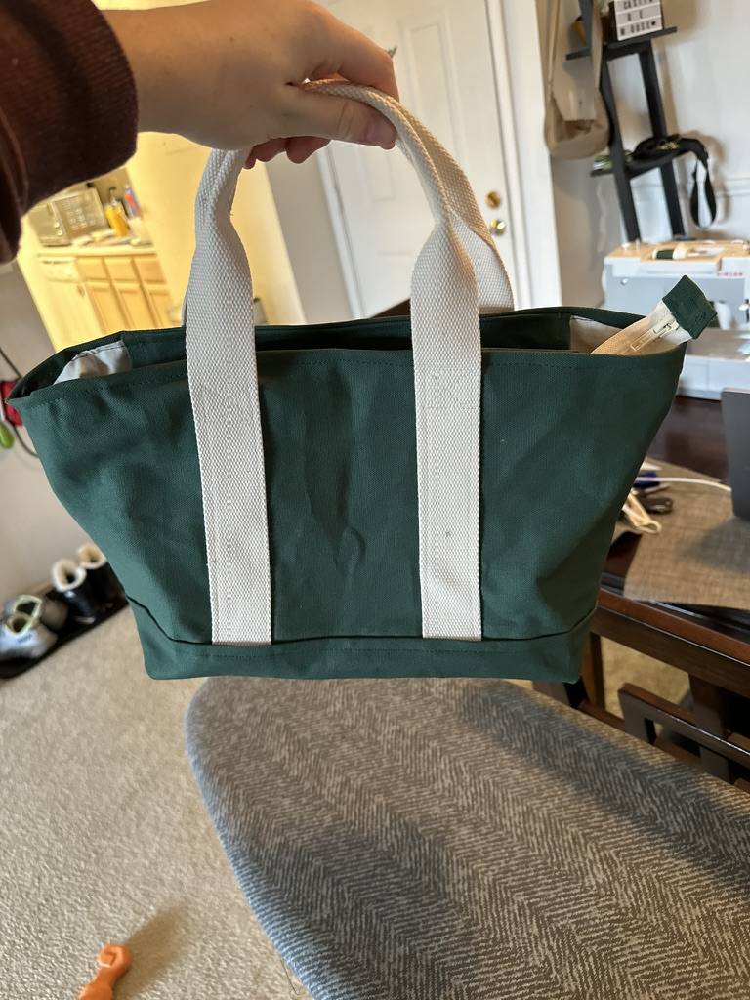

In an effort to keep my new writing and creating habit going, I am going to attempt to do a ‘wrap up’ at the end of the each month. Without further ado, here is what happened in January.

# Moved Websites

In case you’ve not seen, I’ve moved from my previous domain, [emmacampbell.dev](https://emmacampbell.dev), to this new domain [spooky.blog](https://spooky.blog). With moving, I have

- migrated my content
- built a [book tracker](https://spooky.blog/notebook/book-tracker)
- started planning a RSS feed

Some features are still being fleshed out. Maybe take a look around if you'd like!

# Learning to Sew

I’ve decided as part of my efforts to create more, I want to learn to sew. I got a sewing machine for Christmas, and started by sewing a bunch of bandanas for my dog, Moose.

And in true ADHD fashion, I jumped straight into a canvas bag.

The seams don’t really line up on the sides, but... not bad for a first real attempt.

---

So there you have it! Two highlights from January.
