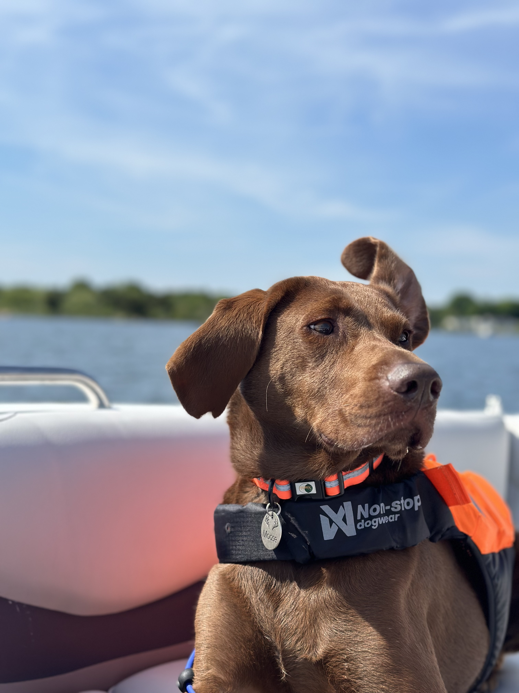
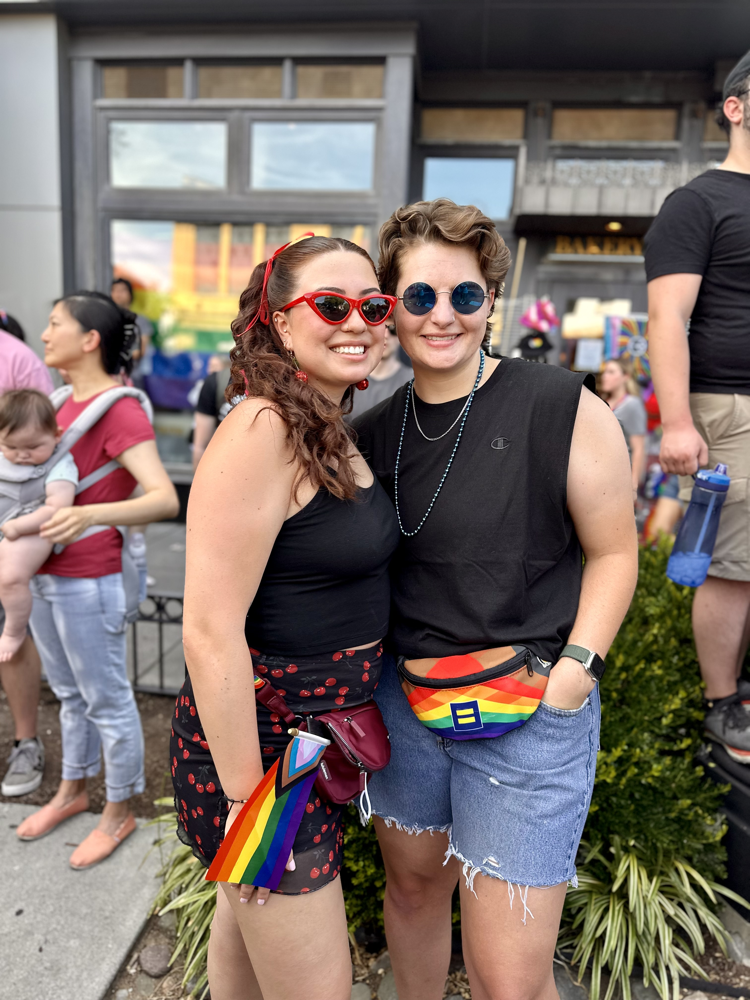
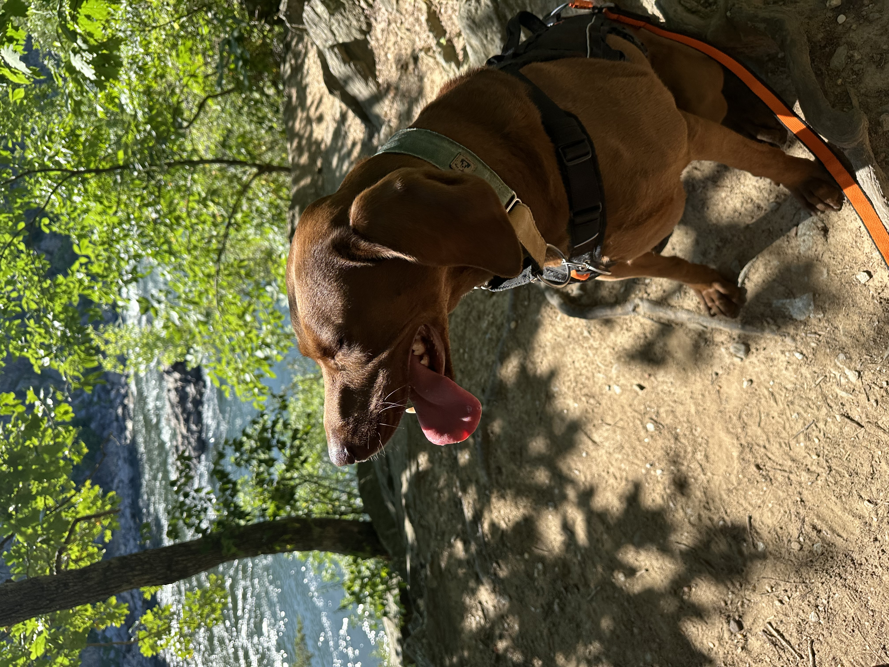
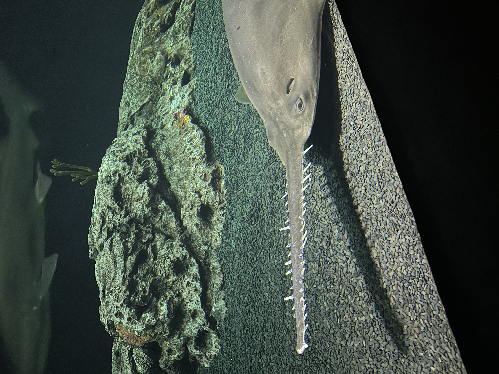
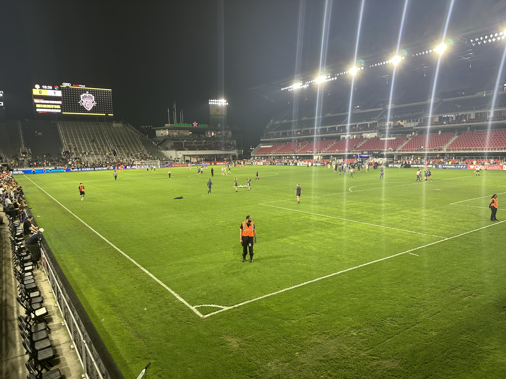

## Notable

**Rhode Island**. For the end of May/beginning of June, I was in Rhode Island. I went on a few hikes, and started teaching Moose how to hang out on a paddle board. I had a great time!

**D.C. Pride**. This year’s pride parade was a blast! They changed up the route this year (likely in preparation for World Pride next year), thus it felt different than the past three we have been to. But nonetheless, a fun time.

**Great Falls National Park**. Andrea and I spent a long, fun day in the Great Falls area, starting early with Great Falls National Park. We did their river loop trail, which was a fun challenge since we have recently started hiking. This was the first time she, Moose, or I have encountered any rock scrambles on our hikes. It was fun, but there were a few moments where I thought that Moose was going to pull me off the side of the cliff and into the Potomac down below. We wrapped up our hike by stopping at a local brewery (with local farm to table meals) and had the best burgers we’ve had in a while.

**Baltimore Aquarium**. If you didn’t know this about me, I’m a big aquarium fan. I always loved fish, and was infatuated by marine life. In fact, I wanted to be a Marine Biologist for a good part of my childhood. We finally got to make it up to the Baltimore Aquarium. I was super excited to go.

The aquarium had neat architecture, and had cool exhibits about everything from the local water ways, to the Amazon. While I enjoyed my time, I think I am partial to the Shedd aquarium in Chicago, but that may be due to the timing of our visit. We went on one of the hottest days in a while, and on a Saturday, which meant for a lot of people trying to do indoor activities, and made it hard to spend enough time reading the plaque because everyone was trying to get a view.

**SOCCER**. Would you have guessed it? I spent a ton of time watching soccer this month, due to the Euros and Copa America happening. We wrapped up the month by going to the Washington Spirit’s Pride Game. The soccer train won’t be stopping any time soon. With the Olympics starting in June, I know my days will continue to be full of the sport.

**Moving Prep**. At the time of writing this, we are t-minus 18 days from our move out day. I’ve been trying to fight the anxiety, but have been having a rough go at it. I struggle with routine disruptions, and this is a _major_ routine disruptor. Send positive thoughts my way, lol.

# Numbers

|Habit|Count|
|:--:|:--:|
|Active Days|22|
|Miles|22.9|
|Workout Hours|19|
|Walks|11|
|Weight Lifting|11|
|Hiking|5|
|Reading Days|10|

## Content

Read

* 1984 by George Orwell

Watched

* Loot
* The Bear s3 (started)
