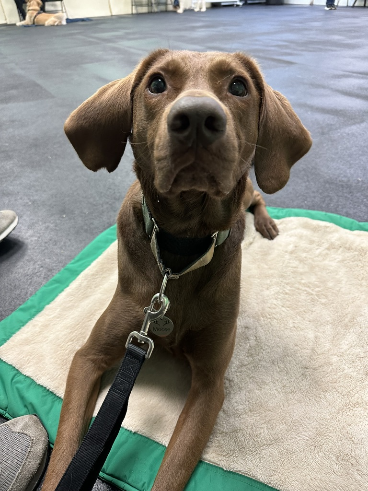

March utterly _flew_ by and honestly I feel like I haven’t had a second to catch my breath. I had a lot going on, so we will jump right to it.

# College Road Trip

My partner and I started the month by going on a mini Midwest college tour. She applied to grad school in Psychology this cycle, and got into a few schools. We toured all them but ultimately, Indiana University was the best fit for our little family.

Go Hoosiers!

We are officially moving to Bloomington come August. Wish us luck with the moving hassle!

# Finished Moose’s Intermediate Training

Since the beginning of February, we have been going to weekly training classes with our dog Moose. He graduated from his intermediate course the last week of March.

# Cherry Blossoms

Andrea’s extended family came and visited, so we spent some time at the national mall and tidal basin.

The flowers this year were beautiful! And because we went early on a Friday, it wasn’t too busy either.

