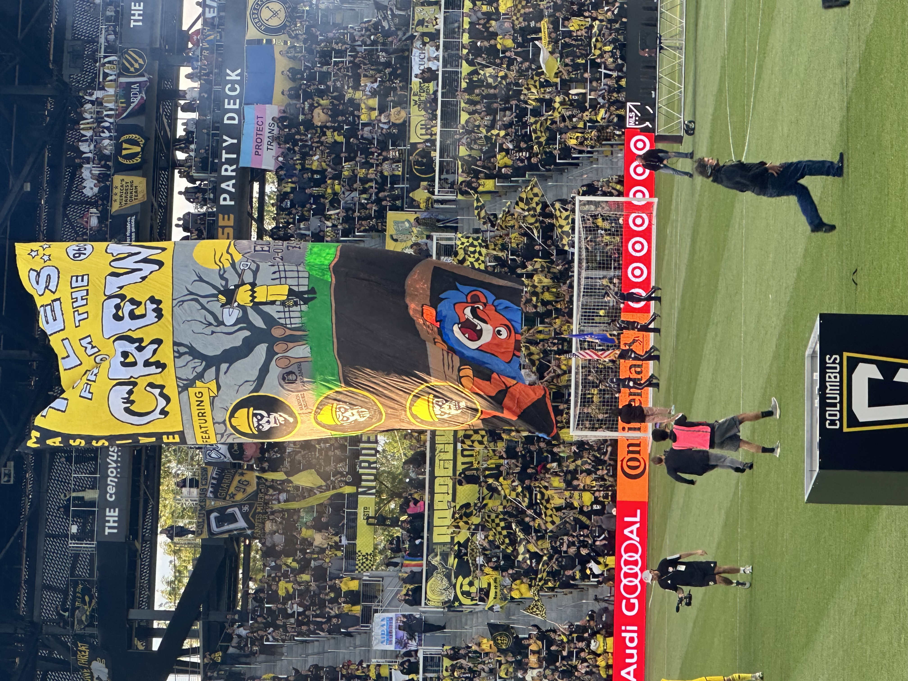
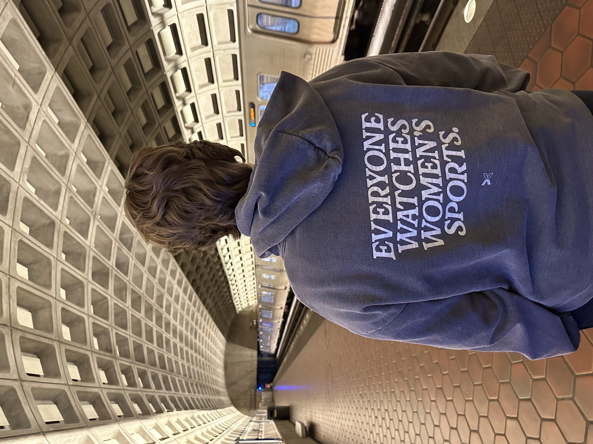

This is so very delayed and for that I am sorry! I was traveling again at the very end of the month and it completely slipped my mind.

So here I present May, a sports filled month of sports.

# Notable

**My Beloved Crew**. I went out to Columbus again to watch my team play our bitter rivals from Kentucky (Cincinnati 🙄). It was my first “Hell is Real” rivalry match, and we lost at home for the first time. Maybe I should have stayed home, lol.

**My First Mystics Game**. Andrea and I went and saw the Washington Mystics on their opening game day. I won’t pretend to have been a long time WNBA fan, but this past NCAA March Madness tournament had me watching and remembering how much fun the sport is. It was a fun game.

**I’ve got the Spirit!** More sports? Who would have guessed. I went out to Audi Field to watch the Washington Spirit take on Angel City. The Spirit were victorious, 4-2. And Trinity Rodman is a BEAST!

**Touching Grass**. Andrea and I are doing our best to be more active. One of the things we’ve found to be really beneficial for our anxiety is hiking. We went on 5 hikes this month (most on weekends). I hate it when mental health walks work.

# Work

I’ve been rewriting our data export system into a brand new asynchronous tasks service to try to better handle the memory crashes that often occur with the current system.

# Numbers

|     Habit      | Count |
| :------------: | :---: |
|  Active Days   |  22   |
|     Miles      | 22.9  |
| Workout Hours  |  19   |
|     Walks      |  11   |
| Weight Lifting |  11   |
|     Hiking     |   5   |
|  Reading Days  |  10   |

# Content

Read

- Tower of Dawn by Sarah J. Maas
- Kingdom of Ash by Sarah J. Maas

Watched

Nothing new here!
