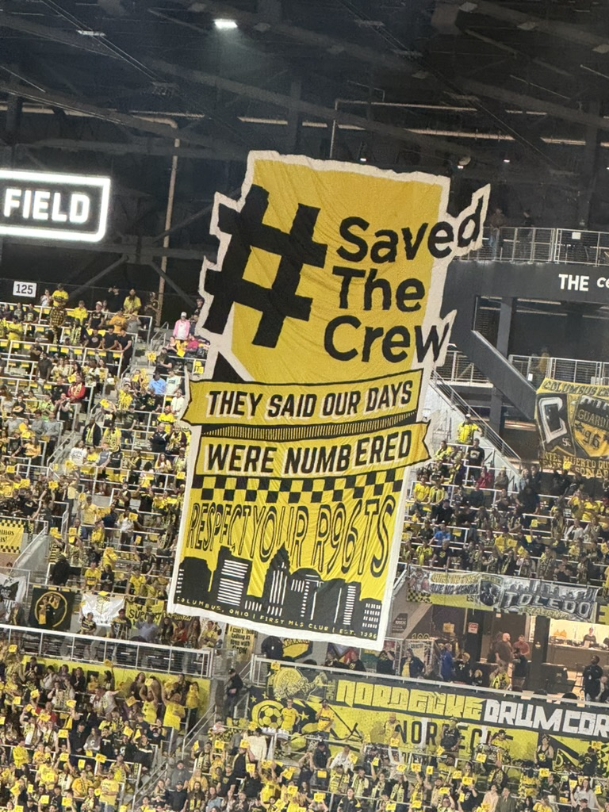
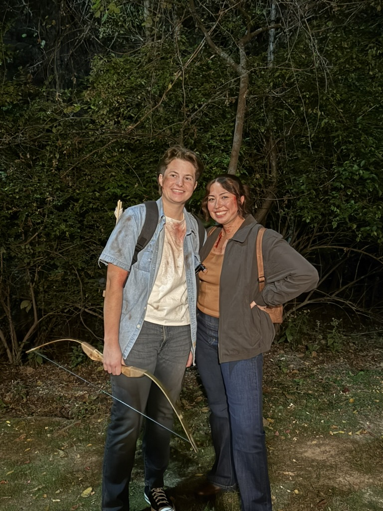

Well, it’s been a few months now, hasn’t it? The past few have been nothing short of utterly chaotic.

At the beginning of August, my mom ended up in the hospital for eight days and was susequently diagnosed with Myasthenia Gravis, a rare autoimmune disorder where your body attacks your muscles at the point that they recieve nerve impulses.

She had a myasthenic crisis, which had landed her in the hopsital. It was utterly terrifying, but she is doing better now. Needless to say, it’s been a wild few months and I fell way behind.

## Notable

**10.05 Twenty One Pilots**. At the very beginning of October I got to see Tweenty One Pilots at Nationwide Arena in Columbus. I’ve seen them numerous times and this show was no different than the rest. They put on a good show. This show, they were recording for a live album, which was pretty neat!

**10.12 Columbus Crew vs. Revs**. This game was rescheduled from way back in April, but it was nice as always to get to see my favorite team play. I watched Matan score a hattrick over former Crew coach Caleb Porter’s side, which was very sweet to see. The match also happened to fall on the anniversary of save the crew!

**10.25 Halloween Party.** For Halloween this year, Andrea and I dressed as Ellie and Dina from the Last of Us II, my favorite video game.

## Content

##### Read

- Demon Copperhead by Barbara Kingsolver
- Remarkably Bright Creatures by Shelby Van Pelt
- The Midnight Party by Matt Haig

##### Watched

- Heartstopper Season III
- Agatha All Along