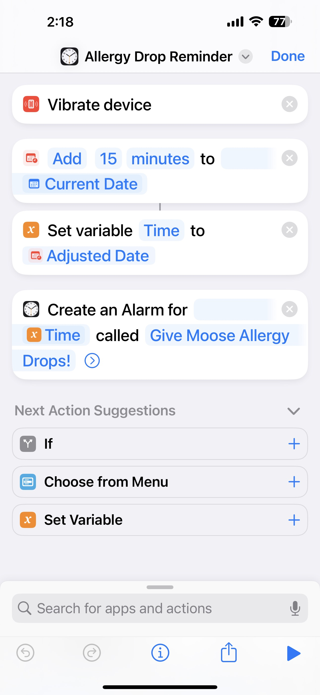
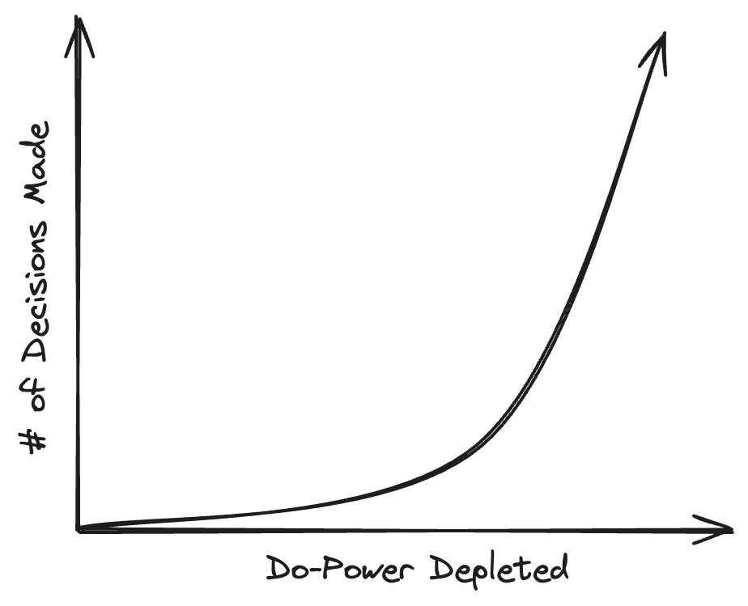

> The experiment below is based on tips and tricks that have worked for _my_ flavor of ADHD. I am not a medical professional,
> so take all of these with a grain of salt.

Let me start this off by saying that I am not formally diagnosed with ADHD. I’ve had symptoms all my life, and my Dad and brother
have both been formally diagnosed and medicated for it. I was your typical presentation in girls, so my parents had a hard time
recognizing that I had it too. I have given myself a self-diagnosis.

High school was easy. I put little to no effort into my school work, finished homework while in class and made it out with all
A’s and high honors. College was a completely different story. I struggled because I never learned how to study. I found myself
completely distracted in large lecture halls, unable to focus on the task at hand. I went through bouts of depression and anxiety
over trying to maintain the same level of success that my classmates seemed to achieve with the same amount of effort.

What came from this dysfunction was that I learned how to create systems that keep me on pace with others. I call them
_self-accommodations_. For example, my dog takes allergy "drops" after each meal to help with his environmental allergies. They work
great, but the annoying part is that you need to wait about 15 minutes after he eats in order for them to work properly. Previously,
I would sit the bottle on the counter as a reminder that he hadn't yet taken them. However, I would forget about them unless I walked
into the kitchen and saw them sitting on the counter. This led me to start thinking about how I could bring this to my attention
without physical cues.

# External Cues

I think the hardest part about dealing with ADHD and habits is that internal motivation doesn't work the same as it does for
neurotypicals. I know those drops are helpful to my dog, and I know he feels better when he takes them. Those are
intrinsic/internal motivators. They _don't_ work for me, and I recognize that.

So, how do I cue the task? For this specific problem, I made a "shortcut" on my phone that creates an alarm that goes off 15 minutes
after scanning a NFC tag that is near my dogs allergy medications. When the alarm goes off, I am cued to get up and give him the drops.
I call this an **external interrupter**.

## Interrupters

An external interrupter provides an **intrusive** cue for whatever task you are trying to accomplish. Because these interruptions can be
jarring, it is good to reserve them for _time-sensitive_ tasks, so you aren't interrupting any flow states.

Something I struggle with is restarting tasks when my flow state has been interrupted. Besides folding, this might be the reason that
laundry is the bane of my existence. Because it's a long, drawn out event, setting an alarm often interrupts work tasks that require
a lot of focus, and leave my frustrated, and delayed while trying to restart the task. Interrupter don't work for me and this kind of
routine.

## Hints

An external hint provides a **visible** cue for the task you are trying to accomplish. Like external Interrupter, they provide some
form of tangible cue for you to start your next task. The difference between hints and Interrupter, is that hints aren't going to
knock you out of your current task. But they are visible enough that you will be reminded of the thing you need to do.

In the laundry example, I have a similar set-up to the interrupter. I scan a NFC tag, but instead of creating an alarm, a reminder
is created in Things 3 for 70 minutes later so that it sits on the lock screen of my phone and I don't forget that I have wet clothes
sitting in the washer. That way, the next time I am at a stopping point and I inevitably pick up my phone, the first thing I see is
the visible cue that I have to switch my laundry. Another example of a visible cue is filling up my gallon water bottle as a reminder to
drink water throughout the day.

## Picking a Cue

So, this begs the question. How does one pick a cue?

There are two main things I take into consideration when picking what type of cue I want to use.

1. When does this task take place?
2. Does this task need to happen at a certain time?

If the task happens throughout the work day, where interrupting tasks can be distributive to the amount of work I can get done,
then I will gravitate towards a "hint". If the task needs to happen at a certain time, then I will likely choose an interrupter.

# Do-Power

Another important factor I try to consider when creating routines and systems is the concept of "do-power". It's similar in concept
to will-power, but I find will-power to have rather negative connotations. Lack of do-power doesn't make you lazy, or mentally weak.
In fact, this is quite similar to spoon theory[^1].

Basically, everyone comes equipped with a do-power reserve. Whenever you need to do a task, you need to reach into that reserve
and it will provide the energy to complete it. The amount of do-power a task requires is highly dependent on the person.

Say I need to do laundry. For me, laundry is something that takes a lot of do-power for a couple of reasons. The first is that
it takes awhile, and second is that it's a bunch of micro-tasks together. Essentially, a mini-project. I tend to get overwhelmed by
things that have multiple steps, and avoid starting.

On the flip side, making a grocery list is something that also requires a lot of do-power. That is because it requires a ton of
decisions to be made.

## Relationship between Do-Power and Decision Fatigue

_Decision fatigue_[^2] is a psychology concept that says the more decisions someone makes in a day, the more physically, mentally,
and emotionally drained they become. Because, let's face it. Decisions use a lot of cognitive and executive functioning skills, and
people with ADHD already have a difficult time with these to begin with.

This is just something to be cognizant of when you're building routines and queues. As the day goes on, you'll likely have made
decisions that drain the do-power tank. So maybe, don't put things your avoiding at the end of the day, because you'll likely
keep avoiding them.

# Where doesn't this work?

The system so far works great for small, single action tasks. Where I run into issues are tasks that are much more loaded (i.e.
there are multiple steps involved). Take going to the gym for example.

## The Experiment: Building a Consistent Gym Routine

Like I mentioned before I have all sorts of intrinsic motivation for getting to the gym. I know that it is good for me,
and I know that it will make my chronic conditions better. But, I've been unable to make a consistent routine. So I took a
moment to try to recognize where this all was breaking down.

I started by listing out the general steps that go into getting to the gym.

1. Plan what exercises you're going to perform
2. Plan what you're going to wear/pack your bag
3. Walk to the gym
4. Perform the exercises.

If you're thinking about this as a system design question, there are a couple of points of failure.

#### Planning Exercises

Remember the "Do-Power" I talked about earlier? It comes into play in the first breakdown. Planning your routine
for the gym can take a lot of decisions, which drains the do-power reserves. If you try to do this at a point during
the day when your tank is running low, then this may seem like a daunting task.

How did I approach this? I sorta cheated, but I bought an exercise template. The Beginner Template[^3] from Barbell
Medicine, specifically. I did this because it took away a lot of the decision-making that I found draining. All I had
to do was select the day, and then add 1-2 accessory exercises.

#### Packing the Bag

The only real time this would fall apart is if you're short on time. If you forget to pack your bag, or are running
late.

If you've heard of habit stacking[^4], now would be the time to use it. On the nights before you head to the gym,
pack what you can ahead. Set it by the door, and leave your gym clothes out where you can see them (if you like to
work out first thing).

You can tag this on to the very end of your nighttime routine (which, if you don't have one... you should).

#### Walking to the Gym

If you're fortunate enough to live within walking distance to the gym, then there are a couple of ways this might
become a point of failure.

The main reason being that you get stuck deep into what you're doing. In which case, set an external interrupter so
that you can get a move on and get moving.

The other, well, is the weather. And there's really nothing I can do about that 🙄

#### Perform the Exercises

Now, if you're like me, actually being at the gym can be somewhat overwhelming. The main reasons tend to root from
the gym being a generally crowded place. Like if the gym bro using the machine you need is scrolling through TikTok
between sets. There's two main accommodations I've made to combat this.

* If you're fortunate like me, and work from home with flexible hours, go on the off time. I like to go at 10am because
I am not a morning person to begin with
* Switch the order of your workout. This generally isn't too devastating to your routine. Unless, of course
you're trying to avoid doing two leg exercises back to back.
* I write my exercises in a notebook. My phone plays music only, goes on do not disturb, and I get in and out as quickly
as I can.

Some other considerations may be listing some alternative exercises for if the equipment you need is taken.

## Recognizing Breakdown (Iteration)

Sometimes, things don't go according to plan, and that's okay. Part of this experiment is the iterative component where
I see what isn't working, and I make adjustments.

Seriously! You gotta cut yourself some slack. This is actually "phase II" of this experiment. I started off by realizing
that I _hate_ trying to come up with work out routines. So, I bought the plan from Barbell Medicine (this isn't sponsored,
I just really enjoy their plan options). I loved the routine, but still found that I wasn't making it to the gym as
consistently as I wanted to.

So next step? Cueing myself to get there.

Life is honestly one big experiment and failing hard is the way we learn for the next time. I personally would never
trust anyone who hasn't failed somehow in their life.

# Next Steps

Check in a month from now (May 14th, 2024) and see what iterations come next 💪

[^1]: [Spoon theory: What it is and how I use it to manage chronic illness](https://www.washingtonpost.com/wellness/2023/01/14/spoon-theory-chronic-illness-spoonie/)
[^2]: [Wikipedia: Decision Fatigue](https://en.wikipedia.org/wiki/Decision_fatigue)
[^3]: [The Beginner Template by Barbell Medicine](https://www.barbellmedicine.com/shop/training-templates/strength/beginner-template/)
[^4]: [Habit Stacking (Excerpt from Atomic Habits)](https://jamesclear.com/habit-stacking)